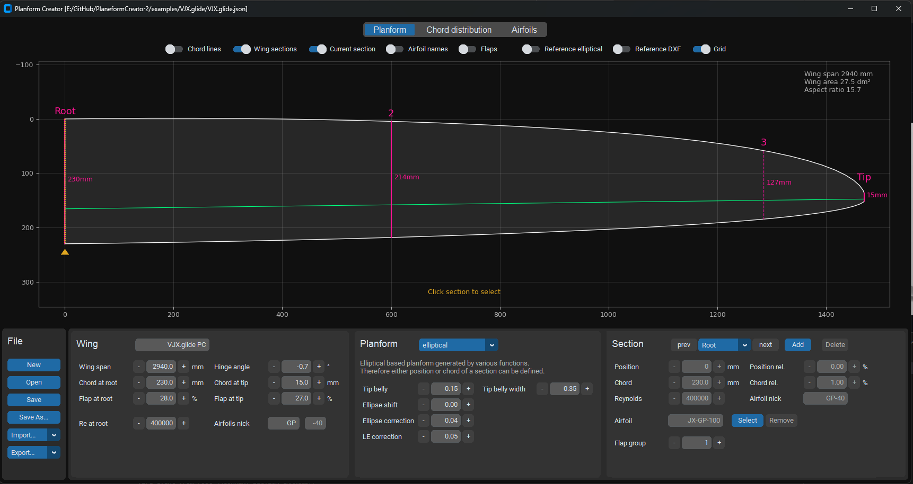
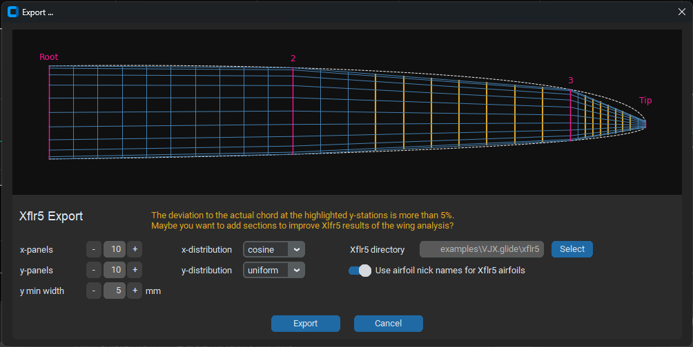
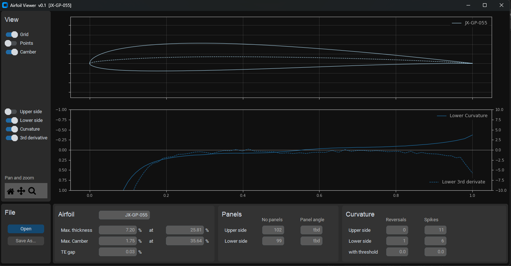

# Planform Creator 2

-- Work in Progress --

An app to design a wing focusing on model sailplanes 

* Define the planform based on elliptical chord distribution functions
* Major parameter is the hinge line of the wing
* Add an arbitrary number of wing sections with fixed position or relative chord length
* Generate blended airfoils for intermediate wing sections ('strak')
* Import dxf outline of a wing either as template for a new wing or as reference for an existing wing
* Export wing definition to
  * Xflr5
  * FLZ_vortex
  * dxf file  - for use in CAD
* View airfoil details and edit itsproperties (tbd) 


Inspired and partially based on the 'Planform Creator' being part of [The Strak Machine](https://github.com/Matthias231/The-Strak-Machine) - Thanks Matthias!  








### Airfoil Viewer

The `AirfoilViewer` shows more detailed information of an airfoil esspecially aspects of its geometry (Functions for modifying the geomtry will be implemented).



###  Install

A pre-build Windows-Exe is available in the releases section https://github.com/jxjo/PlanformCreator2/releases  

or 

Download python sources which can also be found there https://github.com/jxjo/PlanformCreator2/releases

or 

Clone the repository 

and 

Install 

```
pip3 install numpy
pip3 install matplotlib
pip3 install customtkinter
pip3 install termcolor
pip3 install colorama
pip3 install ezdxf
```

 
Have fun!
