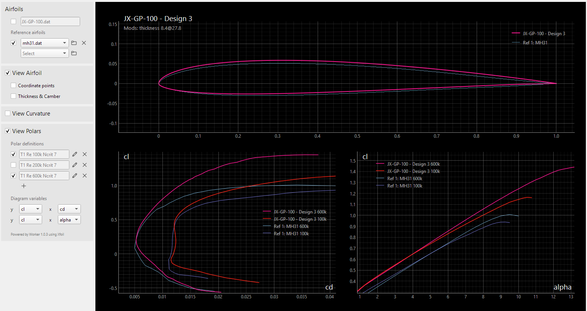

# v3.0


The **AirfoilEditor** is on one hand a fast airfoil viewer and on the other hand a powerful editor to modify the geometry of an airfoil. Focusing on an airfoils geometric and aerodynamic characteristics the principle of this app is: Don't do too much but do it really well.


Main features:  

* View an airfoil and browse through the airfoils of its subdirectory
* Analyze the curvature of the airfoil surface
* Repanel and normalize the airfoil
* Modify the geometry parameters thickness, camber, its high points, trailing edge gap  
* Create a Bezier curve based 'copy' of an airfoil 
* Blend an airfoil with another airfoil 
* :new:  v3: View polars of an airfoil based on xfoil polar generation

The driver for this app was to overcome some of the artefacts using xfoils geometry routines (for example used in Xflr5) when creating geometric 'high quality' airfoils. 

An attempt was made to create a self-explanatory app that invites to play and try out. Hopefully this objective has been achieved ... 


## Geometry: Basic Concepts

The **AirfoilEditor** implements different "strategies" to represent an airfoils geometry:

- 'Linear interpolation' -  Based on the point coordinates of the airfoils '.dat' file, intermediate points are evaluated with a simple linear interpolation. This is used for fast preview and basic operations.
- 'Cubic spline interpolation' - A cubic spline is built based on the airfoils point coordinates. The spline allows to evaluate intermediate points with high precision.
- 'Bezier curve' - An airfoil is represented by two Bezier curves for upper and lower side of the airfoil. A nelder mead optimization allows to approximate the Bezier curves to an existing airfoil.


The spline interpolation is used to find the position of the 'real' leading edge, which may differ from the leading edge of the coordinates (which is the point with the smallest x-value). When 'normalizing' the airfoil, the 'real' leading edge is taken in an iteration to rotate, stretch and move the airfoil to become 0,0 - 1,0 normalized.

For thickness and camber geometry operations the airfoil (spline) is splitted into two new splines representing thickness and camber distribution. For moving the highpoint of either thickness or camber a mapping spline for the airfoil coordinates is used quite similar to the approach implemented in xfoil. After these operations the airfoil is rebuild out of thickness and camber. 

The same approach is applied to move the highpoint of the upper and lower side of the airfoil which makes it possible to optimize the upper and lower side independently of each other.


<sub>The 'Edit Mode' of the **AirfoilEditor** to change the geometry either by value or by moving the mouse helper points. Each change creates a new 'Design' variant which allows to browse through the changes made in this session. </sub>
<br></br>

Repaneling is based on a modified cosine distribution of the airfoil points on the arc of the spline. The bunching of the coordinate points at leading and trailing edge can be adjusted. 

An airfoil may be 'blended' with another airfoil to create a new airfoil that has the genes of both airfoils.

### Curvature 

On of the major views on an airfoil in the **AirfoilEditor** is the curvature of the airfoils surface. It allows a quick assessment of the surface quality and to detect artefacts like a 'spoiler' at the trailing edge which is quite common. 


<sub>The additional 'Curvature View' on the airfoil indicating reversals of the curvature. </sub>

> [!TIP]
Have a look at the [documentation of Xoptfoil2](https://jxjo.github.io/Xoptfoil2/docs/geometry) for more information about an airfoils geometry.  


### Bezier based airfoils 

Beside `.dat` files the **AirfoilEditor** seamlessly displays `.bez` files defining a Bezier based airfoil. 


A special feature is the definition of a (new) airfoil based on two Bezier curves for upper and lower side. The  control points of the Bezier curve can be moved by mouse.

The 'Match' function performs a best match of the Bezier curve to an existing airfoil. For this a simplex optimization (Nelder Mead) is performed to 
- minimize the norm2 deviation between the Bezier curve and the target airfoil
- align the curvature of the Bezier curve at leading and trailing to the targets curvature. 
- ensure the curvature at leading edge on upper and lower side is equal 


<!---
## Hicks-Henne based airfoils 

Hicks-Henne “bump” functions are applied to a base airfoil and add a linear combination of single-signed sine functions to deform its upper and lower surfaces to create a new airfoil shape.
They are used in the airfoil optimizer Xoptfoil2 as an alternative to Bezier curves to create new airfoil designs. 

The Airfoil Editor allows to visualize the Hicks-Henne functions which were applied to an airfoil. For this a special file format '.hicks' is used to interchange with Xoptfoil2.


<sup>Visualization of the Hicks-Henne bump functions, which were applied to the upper and lower side of the airfoil</sup>

-->
<br></br>

## Airfoil Polars

To generate the polars of an airfoil the **AirfoilEditor** uses the **Worker** tool of the [Xoptfoil2 project](https://jxjo.github.io/Xoptfoil2). On of the `Worker` actions is the multi-threaded creation of a polar set using Xfoil.

Within the app a polar is generated 'lazy' - meaning at the moment when the polar should be displayed - and asynchronous in a backround task. Each polar is stored in a single file having the Xfoil polar format. This approach allows to step through airfoils or the designs of an airfoil and present the polars without further user interaction.

For polar generation the `auto_range` feature of the `Worker` is applied which optimizes the alpha range of the polar to show the complete T1 polar from cl_min to cl_max of the airfoil. For T2 polars (constant lift) the range starts right above cl=0.0 to cl_max.


<sub>Polar view with polar definitions and settings for the polar diagrams. The polars were generated in the background. </sub>

### Airfoil Direct Design 

The combination of the 'Edit Mode' and automated polar generation allows a playful approach to a 'Direct Design' of an airfoil based on its geometry: Each modification, e.g. moving the camber highpoint or the control point of a Bezier curve, will generate a new design with its individual new polars. Stepping through the design polars creates an intuitive understanding how geometeric modifications influence the aerodynamic characteristics of an airfoil. 



<sub>Direct Design with automated polar generation. The current design is compared with the reference airfoil MH31
. </sub>


## Short Introduction 

Have a look at this little video showing the main functionality of the **AirfoilEditor** v2:

[](https://youtu.be/gkgPbVkOAcU)


## Software Aspects

The **AirfoilEditor** is developed in  [Python](https://www.python.org/) using [PyQt6](https://pypi.org/project/PyQt6/) which wraps and extends the [Qt UI framework](https://www.qt.io/product/framework) and [PyQtGraph](https://www.pyqtgraph.org/) which wraps the QT Graphics framework. 

The main building blocks of the App are
* Model - containing all geometry and math helper routines of an airfoil. The model is independent of the UI. The different modules are kept in [modules/model](modules/model).

*  `Worker` tool including Xfoil from the [ Xoptfoil2](https://jxjo.github.io/Xoptfoil2) project to generate airfoil polars.

* UI-Framework - base classes and a little framework to ease the implementation of forms based on widgets and diagrams based on artists for the plot tasks. The base classes are in [modules/base](modules/base) 

* Application - controller and view classes to handle presentation and user interaction - [modules/](modules/) 

The airfoil model and the base classes also form the core of other Apps like the [Planform Creator2](https://github.com/jxjo/PlanformCreator2) . 

##  Install

A pre-build Windows App including `Worker.exe` for polar generation is available in the [releases section](https://github.com/jxjo/AirfoilEditor/releases)  

or 

Download python sources from [releases](https://github.com/jxjo/AirfoilEditor/releases) or clone the repository and install 

```
pip3 install pyqt6
pip3 install numpy
pip3 install pyqtgraph 
pip3 install termcolor
```

Linux users who want to use polar generation have to compile the Worker tool of the [ Xoptfoil2 project](https://jxjo.github.io/Xoptfoil2) and copy the program either into `/usr/local/bin` or into the sub folder `./assets/linux` of the AirfoilEditor. In the second case the execute permission has to be set with `chmod +x Worker`.  

> [!TIP]
 For Windows: Use the "Open with ..." Explorer command to connect the `AirfoilEditor.exe` to the file extension `.dat`. Later a double click on an airfoil dat-file will open the **AirfoilEditor** and you can browse through the files in the directory (if you are using the Python version, create a little batch job to open an airfoils dat-file)  

---

Have fun :wink:

[Jochen](mailto:jochen@jxjo.de)  

