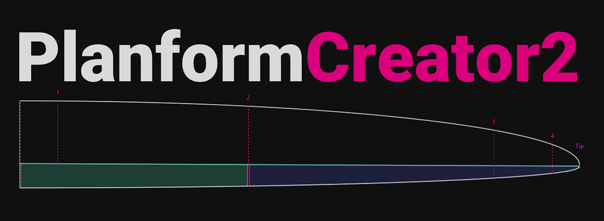
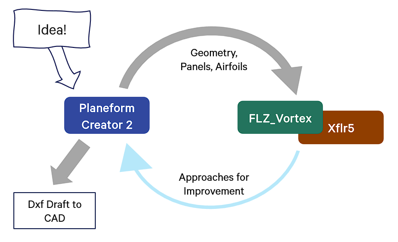
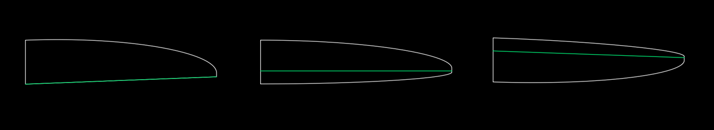
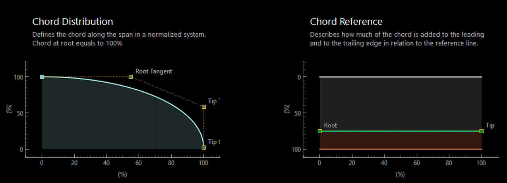
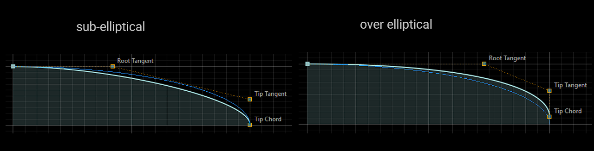
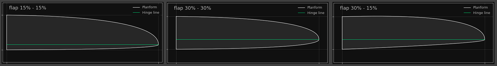
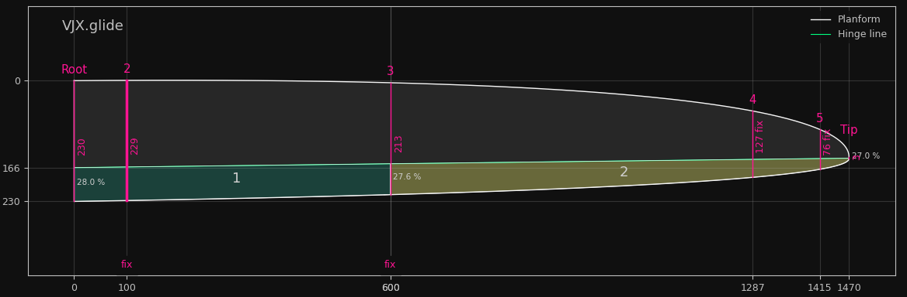
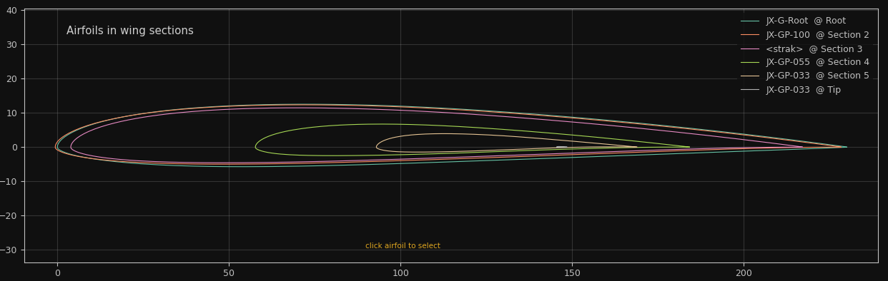
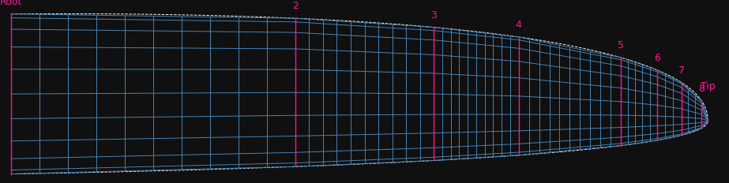
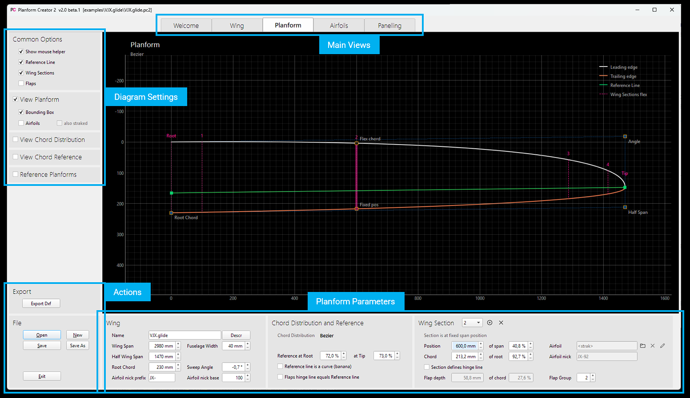

##

The Planform Creator 2 - short PC2 - is an app to design the planform of a wing focusing on model sailplanes 

Main features: 

* Define a planform based on a chord distribution along the wing span
* A chord reference defines how the chord is assigned towards leading and trailing edge  
* Add wing sections with fixed position or relative chord length
* View airfoil at wing sections and edit its properties using the [Airfoil Editor](https://github.com/jxjo/AirfoilEditor)
* Generate blended airfoils for intermediate wing sections ('strak')
* Define flaps hinge line and flaps 
* Import image of an existing wing as abackground image for design
* Auto panelling of the planform as preparation for aerodynamic calculation 
* Export wing definition and airfoils to
  * Xflr5 
  * FLZ_vortex
  * dxf file  - for use in CAD

The project was inspired by the 'Planform Creator' being part of [The Strak Machine](https://github.com/Matthias231/The-Strak-Machine) - Thanks Matthias!   

## Basic concepts

The idea behind Planform Creator 2 is to have a tool to design a new wing with a more graphical, 'playful' approach. It tries to fill the gap between CAD based design and aerodynamic analysis tools like Xflr5.



Within the early design process of a wing Planform Creator 2 is the master of 'truth'. It provides the data for the aerodynamic analysis. The findings in the analysis can be used to modify the planform. 

When the results are satisfying the planform and the envolved airfoils are exported as dxf to a CAD program to continue with the final 3D design e.g. for a mold of the wing. 

In contrast to a "paint program", the planform is defined by parameters such as 'span', 'root depth' or "sweep of hinge line". The chord distribution along the span is controlled by a mathematical function via parameters.
The advantage is that the parameters can be changed independently of each other, allowing a quick approach to the desired wing planform.


<sup>All three planforms have the same chord distribution - and also the same wing area - but varying how the chord is assigned by the reference line</sup>
</p>

## Designing a planform 

'Form follows Function' - this is especially true in PC2: The planform of a wing results from a combination of functions and parameters. 

### Chord distribution 
Most important and usually defined first, is the chord distribution along the wing span. The geometric chord distribution directly and significantly determines the lift distribution along the span. The local lift coefficient depends on the local effective angle of attack (influenced by the wing shape) and on the local Reynolds number, which changes proportionally to the local chord.

Two different "types" are available for defining the chord distribution:
- Bezier curve: Using a start tangent at the root and a end tangent at the wing tip, the curve of the chord distribution is defined by dragging the control points with the mouse
- Trapezoid: For the definition of a (multiple) trapezoid wing. The chord is defined by the chord length of the individual wing sections.

In PC2, the chord distribution is always displayed in normalized form. Both span and chord length range from 0 to 1. This allows chord distributions - even of different wing designs - to be compared with each other without distortion.





<sup>Variations of the chord distribution using a Bezier curve. The blue curve is a pure elliptical chord distribution as reference  </sup>
</p>

### Chord Reference Line 
The hinge line is the main 'construction line' of PC2. By determining flap depth at the root and tip, the chord distribution is, figuratively speaking, threaded onto the hinge line, which results in a final planform. Thereby both flap depth at the root and flap depth at tip strongly influences the planform:


<sup>Impact of different flap depths on planform of the wing </sup>
</p>


### Hinge Line and Flap Depth
The hinge line is the main 'construction line' of PC2. By determining flap depth at the root and tip, the chord distribution is, figuratively speaking, threaded onto the hinge line, which results in a final planform. Thereby both flap depth at the root and flap depth at tip strongly influences the planform:


<sup>Impact of different flap depths on planform of the wing </sup>
</p>


### Everything banana?
A little speciality is the so called "banana function". It allows to bent the wing in spanwise direction like a banana without changing the chord distribution. The function does not actually serve to visually embellish the wing, but it allows the normally linear flap depth distribution to be modified flexibly to finetune lift distribution when flaps are set. 


<sup>Modifying the flap depth distribution with the 'banana function'</sup>
</p>

### Wing sections

The airfoils of the wing are defined at 'wing sections'. A wing always has at least 2 wing sections - at root and wing tip. In between, any number of wing sections can be created. There are two types of wing sections, which are defined by their ...
- span position: The wing section always remains at this position, even if, the wing span or chord distribution is changed
- chord length: The wing section moves with the planform when it is changed in order to always have the same chord length. This is especially useful to have an airfoil at a certain chord length (= Reynolds number) within the wing.


<sup>For this wing, in addition to the root and the wing tip, 4 further wing sections were defined: 2 with a fixed position and 2 with a fixed wing depth. The wing sections were assigned to a flap group so that the individual flaps can also be displayed. </sup>

Finally, a wing section can be assigned to a "flap group". The flaps defined in this way have no further function in PC2 and are only used for display. When exporting to FLZ_vortex, however, the flap definition is included and can be used there to simulate flap deflections.

### Airfoils

A wing section can either be assigned a fixed airfoil or the airfoil can be left open. In this case, a 'strak' (or 'blended') airfoil is created for this wing Section by blending the left and right neighboring airfoils. The "blending ratio" is derived from the ratio of the respective chord length of the wing sections.


<sup>Wing sections with the corresponding airfoils. The airfoil at 'section 3' is created by blending JX-GP-100 and JX-GP-055. The airfoils have a "nick name" - here "GP" - to ease readability.  </sup>
</p>

The airfoils can either be viewed in normal, normed scale or in their 'real' scale within their wing sections:



Optionally, a short 'nick name' can be assigned to the airfoils of a wing. The nick name gets a number in addition, which results from a re-number specification at the root (basis is the percentage chord length of a wing section to the root chord length).  

All airfoils, including the generated 'strak' airfoils, can be exported as a .dat file at the end. Very practical is the optional setting of a continuous trailing edge thickness ('Te gap') in mm, which eliminates the often necessary manual reworking of the airfoils in CAD. 

A spin off from this project is the  [Airfoil Editor](https://github.com/jxjo/AirfoilEditor) which allows the typical modifications of an airfoil during wing design. 


<sup>The AirfoilEditor can also be used as a stand-alone program. Linked with the file extension ".dat" it acts as a smart display and edit app for airfoils.</sup>

## Bridge to Xflr5 and FLZ_vortex

One of the most important functions of PC2 is the export of the designed wing to FLZ_vortex or Xflr5 for aerodynamic calculation. In each case, the wing definition is prepared "bite-sized" for the respective program. 
Both programs idealize an airfoil by trapezoidal segments. In the case of a strongly curved leading or trailing edge this can lead to considerable geometrical deviations and thus inaccuracies of the calculation. PC2 tries to detect such a deviation which is too high...


<sup>Export of a wing to Xflr5. Yellow marked are the panel segments, which have a too high deviation from the original planform due to the idealization as trapezoids</sup>

... whereupon one should create additional wing sections with a few clicks to get a significantly better idealization ...
  


<sup>With additional wing sections, the idealization of the wing planform is significantly improved.</sup>

The generation of the panels in x- and y-direction can be further controlled by the usual distribution functions "sinus", "cosinus" and "uniform".
A special feature of the export still takes place at the wing tip: If the chord length of the wing tip is too small, tip is cut off in order to obtain a chord length at tip which is still manageable in aerodynamic analysies programs (the problem is, among other things, a too low Reynolds number within the aerodynamic calculation). 

In Xflr5, the airfoils must be imported separately and a polar set calculation for each airfoil must be performed. 
FLZ_vortex can optionally be started directly from PC2 and a calculation can be initiated directly (only Windows: prerequisite is to assign the file extension ".flz" to the program FLZ_vortex.) 

## Export as dxf file 
Once the wing design has been completed, the new wing can be transferred to a CAD program as a dxf file. The used airfoils are optionally inserted into the drawing and / or additionally exported as a .dat file.


The generated planform shouldn't be used directly for a 3D construction in the CAD program, since the contour line is approximated by many small straight line pieces (polyline). It is recommended to place a spline over the leading and trailing edge in the respective CAD program.

## The App - a quick look 
  
An attempt was made to provide a simple, intuitive UI to be able to 'playfully' explore the program and the design of a new wing. 



The upper tabs are used to switch between the different main display views. On the left (in the 'View' area) are the selection buttons to customize the selected view. A zoom and pan function allows to look at details.

At the bottom left are the usual file functions. Here you also find the different export and import capabilities.

In the lower main area the input or modification of the wing parameters takes place. The most important parameters can alternatively be changed directly in the diagram with the mouse ('Mouse helper' switch in the 'View' area). 

Included in the installation are two example projects which give a good overview of the possibilities of PC2.
- F3F wing 'VJX.glide' (this is a real life design) 
- Flying wing "Amokka-JX" with straight trailing edge   
(the examples can be accessed via 'Open' in the exmaples sub directory) 


##  Install

A pre-build Windows-Exe is available in the releases section https://github.com/jxjo/PlanformCreator2/releases  

or 

Download python sources from https://github.com/jxjo/PlanformCreator2/releases or Clone the repository 

and Install 

```
pip3 install numpy
pip3 install matplotlib
pip3 install customtkinter

pip3 install termcolor
pip3 install colorama
pip3 install ezdxf
```

 
Have fun!

jochen@jxjo.de
