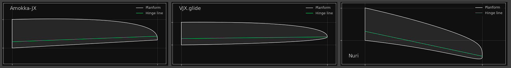

# Planform Creator 2


An app to design a wing focusing on model sailplanes 

* Define the planform based on chord distribution functions
* Major parameter is the hinge line of the wing and the flap depth at root and tip
* Add an arbitrary number of wing sections with fixed position or relative chord length
* Generate blended airfoils for intermediate wing sections ('strak')
* Import dxf outline of a wing either as template for a new wing or as reference for an existing wing
* Export wing definition to
  * Xflr5
  * FLZ_vortex
  * dxf file  - for use in CAD
* View airfoil and edit its properties 

Inspired and partially based on the 'Planform Creator' being part of [The Strak Machine](https://github.com/Matthias231/The-Strak-Machine) - Thanks Matthias!  


Some variations of wing planform when flap depth  ...


... or hinge line angle is changed



Export the wing design prepared for Xflr5 or FLZ_vortex 


## Airfoil Editor

The `AirfoilEditor` is part of PLanformCreator2 and shows more detailed information of an airfoil like thickness and camber distribution or curvature of the surface. 


Operations like repaneling, normalizing and changing geometry parameters make extensive use of splines to achieve high precision results. 


A new airfoil may be designed based on two Bezier curves for upper and lower side. The control points of the Bezier curve can be automatically adapted for a best fit to a seed airfoil. 


###  Install

A pre-build Windows-Exe is available in the releases section https://github.com/jxjo/PlanformCreator2/releases  

or 

Download python sources which can also be found there https://github.com/jxjo/PlanformCreator2/releases

or 

Clone the repository 

and 

Install 

```
pip3 install numpy
pip3 install matplotlib
pip3 install customtkinter
pip3 install termcolor
pip3 install colorama
pip3 install ezdxf
```

 
Have fun!
