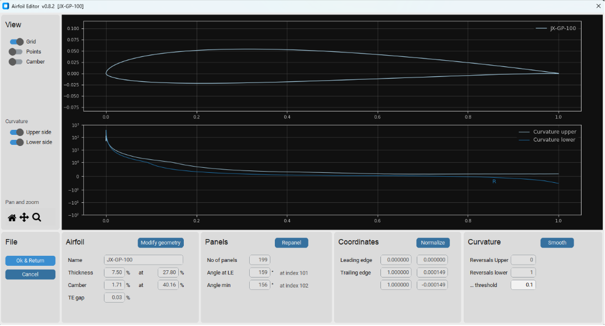
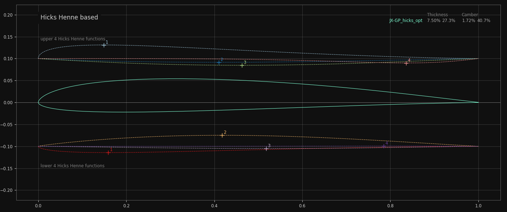

# v2.0


The AirfoilEditor is on one hand a fast airfoil viewer and on the other hand a powerful editor to modify the geometry of an airfoil. Focusing on an airfoils geometry the principle of this app is: Don't do too much but do it really well.


Main features:  

* View an air foil and browse through the airfoils of its subdirectory
* View the curvature of the airfoil surface
* Repanel and normalize the airfoil
* Modify the geometry parameters thickness, camber, its high points, trailing edge gap  
* Create a Bezier curve based 'copy' of an airfoil 
* Blend an airfoil with another airfoil 

The driver for this app was to overcome some of the artefacts using xfoils geometry routines (for example used in Xflr5) when creating geometric 'high quality' airfoils. The focus of the app is on pure geometry work with airfoils - aerodynamic aspects are out of scope. 

An attempt was made to create a self-explanatory app that invites to play and try out. Hopefully this objective has been achieved ... 





## Basic concepts

The `AirfoilEditor` implements different "strategies" to represent an airfoils geometry:

- 'Linear interpolation' -  Based on the point coordinates of the airfoils '.dat' file, intermediate points are evaluated with a simple linear interpolation. This is used for fast preview and basic operations.
- 'Cubic spline interpolation' - A cubic spline is built based on the airfoils point coordinates. The spline allows to evaluate intermediate points with high precision.
- 'Bezier curve' - An airfoil is represented by two Bezier curves for upper and lower side of the airfoil. A nelder mead optimization allows to approximate the Bezier curves to an existing airfoil.
- (not in 2.0 beta) 'Hicks Henne' - Hicks Henne bump functions are applied to a "seed airfoil" to achieve a new shape (in development for Xoptfoil2)  

The spline interpolation is used to find the position of the 'real' leading edge, which may differ from the leading edge of the coordinates (which is the point with the smallest x-value). When 'normalizing' the airfoil, the 'real' leading edge is taken in an iteration to rotate, stretch and move the airfoil to become 0,0 - 1,0 normalized.

For thickness and camber geometry operations the airfoil (spline) is splitted into two new splines representing thickness and camber distribution. For moving the highpoint of either thickness or camber a mapping spline for the airfoil coordinates is used quite similar to the approach implemented in xfoil. After these operations the airfoil is rebuild out of thickness and camber. 

The same approach is applied to move the highpoint of the upper and lower side of the airfoil which makes it possible to optimize the upper and lower side independently of each other.


Repaneling is based on a modified cosine distribution of the airfoil points on the arc of the spline. This differs from the xfoil approach but the repanel shows 'nice' behavior in aero calculation. 

As an example for the modification functionality of the app, the dialog for repaneling is shown:  


<sup>Dialog for repaneling of an airfoil. Recommendations are given for 'healthy' panel angles.  </sup>
</p>

### Curvature 

On of the major views on an airfoil in the Airfoil Editor is the curvature of the airfoils surface. It allows a quick assessment of the surface quality and to detect artefacts like a 'spoiler' at the trailing edge which is quite common. 


> [!TIP]
Have a look at the [documentation of Xoptfoil2](https://jxjo.github.io/Xoptfoil2/docs/geometry) with more information about an airfoils geometry.  


## Bezier based airfoils 

Beside '.dat'-files the Airfoil Editor seamlessly displays '.bez'-Files defining an Bezier based airfoil. 


A '.bez'-file defines the x,y coordinates of the Bezier control points and looks like: 
```
JX-GT-15
Top Start
 0.0000000000  0.0000000000
 0.0000000000  0.0120189628
 0.0681109425  0.1240586151
 0.6435307964  0.0748001854
 1.0000000000  0.0000000000
Top End
Bottom Start
 0.0000000000  0.0000000000
 0.0000000000 -0.0222920000
 0.3333333333 -0.0240468000
 1.0000000000  0.0000000000
Bottom End
````

A special feature is the definition of a (new) airfoil based on two Bezier curves for upper and lower side. The Bezier editor allows to move the control points of the curve by mouse.

The 'Match' function performs a best match of the Bezier curve to an existing airfoil. For this a simplex optimization (Nelder Mead) is performed to 
- minimize the norm2 deviation between the Bezier curve and the target airfoil
- align the curvature of the Bezier curve at leading and trailing to the targets curvature. 
- ensure the curvature at leading edge on upper and lower side is equal 


<!---
## Hicks-Henne based airfoils 

Hicks-Henne “bump” functions are applied to a base airfoil and add a linear combination of single-signed sine functions to deform its upper and lower surfaces to create a new airfoil shape.
They are used in the airfoil optimizer Xoptfoil2 as an alternative to Bezier curves to create new airfoil designs. 

The Airfoil Editor allows to visualize the Hicks-Henne functions which were applied to an airfoil. For this a special file format '.hicks' is used to interchange with Xoptfoil2.


<sup>Visualization of the Hicks-Henne bump functions, which were applied to the upper and lower side of the airfoil</sup>

-->

## Short Introduction 

Have a look at this little video showing the main functionality of the AirfoilEditor:

[](https://youtu.be/gkgPbVkOAcU)


## Software Aspects

The `AirfoilEditor` is developed in  [Python](https://www.python.org/) using [PyQt6](https://pypi.org/project/PyQt6/) which wraps and extends the [Qt UI framework](https://www.qt.io/product/framework) and [PyQtGraph](https://www.pyqtgraph.org/) which wraps the QT Graphics framework. 

The main building blocks of the App are
* Model - containing all geometry and math helper routines of an airfoil. The model is independent of the UI. The different modules are kept in [modules/model](modules/model).

* UI-Framework - base classes and a little framework to ease the implementation of forms based on widgets and diagrams based on artists for the plot tasks. The base classes are in [modules/base](modules/base) 

* Application - controller and view classes to handle presentation and user interaction - [modules/](modules/) 

The airfoil model and the base classes also form the core of the other Apps of the family like `Planform Creator` and `Airfoil Optimizer` (to come). 

##  Install

A pre-build Windows-Exe of the app is available in the releases section https://github.com/jxjo/AirfoilEditor/releases  

or 

Download python sources from https://github.com/jxjo/AirfoilEditor/releases or Clone the repository 

and Install 

```
pip3 install pyqt6
pip3 install numpy
pip3 install pyqtgraph 
pip3 install termcolor

```

> [!TIP]
 For Windows: Use the "Open with ..." Explorer command to connect the 'AirfoilEditor.exe' to file extension '.dat'. Later a double click on an airfoil .dat-file will open the AirfoilEditor and you can browse through the files in the directory (if you are using the Python version, create a little batch job to open the .dat file)  


Have fun!
