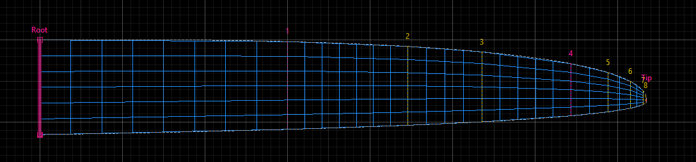

##

The Planform Creator 2 - short PC2 - is an app to design the planform of a wing focusing on model sailplanes 

Main features: 

* Define a planform based on a chord distribution along the wing span
* A chord reference defines how the chord is assigned towards leading and trailing edge  
* Add wing sections with fixed position or relative chord length
* View airfoil at wing sections and edit its properties using the [Airfoil Editor](https://github.com/jxjo/AirfoilEditor)
* Generate blended airfoils for intermediate wing sections ('strak')
* Define flaps hinge line and flaps 
* Import image of an existing wing as abackground image for design
* Auto panelling of the planform as preparation for aerodynamic calculation 
* Export wing definition and airfoils to
  * Xflr5 
  * FLZ_vortex
  * dxf file  - for use in CAD

The project was inspired by the 'Planform Creator' being part of [The Strak Machine](https://github.com/Matthias231/The-Strak-Machine) - Thanks Matthias!   

## Basic concepts

The idea behind Planform Creator 2 is to have a tool to design a new wing with a more graphical, 'playful' approach. It tries to fill the gap between CAD based design and aerodynamic analysis tools like Xflr5.


Within the early design process of a wing Planform Creator 2 is the master of 'truth'. It provides the data for the aerodynamic analysis. The findings in the analysis can be used to modify the planform. 

When the results are satisfying the planform and the envolved airfoils are exported as dxf to a CAD program to continue with the final 3D design e.g. for a mold of the wing. 

In contrast to a "paint program", the planform is defined by parameters such as 'span', 'root depth' or "sweep of hinge line". The chord distribution along the span is controlled by a mathematical function via parameters.
The advantage is that the parameters can be changed independently of each other, allowing a quick approach to the desired wing planform.


## Designing a planform 

'Form follows Function' - this is especially true in PC2: The planform of a wing results from a combination of functions and parameters. 

### Chord distribution and Chord Reference
Most important and usually defined first, is the chord distribution along the wing span. The geometric chord distribution directly and significantly determines the lift distribution along the span. The local lift coefficient depends on the local effective angle of attack (influenced by the wing shape) and on the local Reynolds number, which changes proportionally to the local chord.

Two different "types" are available for defining the chord distribution:
- Bezier curve: Using a start tangent at the root and a end tangent at the wing tip, the curve of the chord distribution is defined by dragging the control points with the mouse
- Trapezoid: For the definition of a (multiple) trapezoid wing. The chord is defined by the chord length of the individual wing sections.

In PC2, the chord distribution is always displayed in normalized form. Both span and chord length range from 0 to 1. This allows chord distributions - even of different wing designs - to be compared with each other without distortion.

The second main definition is the 'Chord Reference' which defines how much of the chord is assigned towards leading and trailing edge along a virtual 'Chord Reference Line'.  


By combining these two functions, scaling the result to a halfwing span and optionally shearing ther result by a 'Sweep Angle' the final planform is created


#### Variations of the Chord Reference 

The concept of "Chord Reference" is quite powerful to create variations of a planform. As the chord distribution is constant, all variations will have the same area and almost identical aerodynamic properties in first approximation. 

The following diagram shows the impact of different chord references while keeping the chord distribution constant.
 


#### Everything banana?
A little speciality is the so called "banana function". It allows to bent the wing in spanwise direction like a banana without changing chord distribution and reference. The result can be a planform like the populae 'bow-style' flying wings. 

Another use case for applying the 'banana function' is to finetune the flap depth alogn the wing span. As the flap hinge line (see further below) is a straght line, benting the planform will directly influence the flap depth. 


### Background image

If you want to recreate an wing based on an existing image, you made load this image as a background image into the app. Having a planform as contour line in the background, it is (most of the times) straight forward to define the chord distribution and the chord reference for a best fit.

There is a little image editor to scale the image and adapt the colors to a 'dark mode' of the image which is best suited as a background. 

Scaling of the image is done by moving the two scale markers to the leading edge of the root and to the very tip point.  


### Wing sections

Once the planform has been defined, another artifact comes into play: 'wing sections'. A wing section has main tasks:
* Define the position of an airfoil within a planform
* Define the position of the flap hinge line and the start of a 'flap group'.

A wing always has at least 2 wing sections - a root and a tip section. In between, any number of wing sections can be created. There are two modes how the location of a wing section can be defined: 
- by span position: The wing section will always remains at this relative span position, even if the wing span or chord distribution is changed. Positioning by span position is helpful for example to define flaps.
- chord length: The wing section is tied to a certain relative chord. When changing the chord distribution, the wing section will moves around in order to always have the same chord length. This is especially useful to have an airfoil at a certain chord length (= Reynolds number) within the wing.


<sup>In this example, wing section '1' at a fixed position is used to define the width of flap and aileron, while section '2' is the home of airfoil 'JX-GP-055' ensuring a certain chord. </sup>

A special case arises with trapezoidal planforms. Here wing sections are also used to define the chord distribution by having both: a fixed chord and a fixed span position. 


<sup>In this trapezoidal planform, wing sections 'root', '1' and 'tip' define the planform. Wing section '2' is just a helper section to have an additional flap at this position. </sup>


### Hinge Line and Flap Depth

Flaps are defined by their 'hinge line' and their bounding wing sections to the left and to the right. A wing section can have a 'flap group' assigned. All subsequent wing sections with the same flap group will define a new flap.

In many cases the hinge line equals the 'reference line' of the planform. This is also the default case when defining flpas. 

More flexibility is achieved through a separate definition of the hinge line with a hinge point at the root section and the tip section. 
In certain cases, for example with a curved reference line, kinks in the hinge line can be defined at a wing section.


## Airfoils

A wing section can either be assigned a fixed airfoil or the airfoil can be left open. In this case, a 'strak' (or 'blended') airfoil is created for this wing section by blending the left and right neighboring airfoils. The 'blending ratio' is derived from the ratio of the respective chord length of the wing sections.

For the root and the tip section an airfoil is mandatory. Initially example airfoils are assigned to these two sections.


<sup>Wing sections with the corresponding airfoils. The airfoil at 'section 2' is created by blending JX-GP-100 and JX-GP-055.</sup>


The airfoils can either be viewed in normal, normed scale or in their 'real' scale within their wing sections:


All airfoils, including the generated 'straked' airfoils, can be exported as a .dat file at the end. Very practical is the optional setting of a continuous trailing edge thickness ('Te gap') in mm, which eliminates the often necessary manual reworking of the airfoils in CAD. 

Included in the Planform Creator 2 isthe  [Airfoil Editor](https://github.com/jxjo/AirfoilEditor) which allows the typical modifications of an airfoil during wing design. 


<sup>The AirfoilEditor can also be used as a stand-alone program. Linked with the file extension ".dat" it acts as a smart display and edit app for airfoils.</sup>

## Bridge to Xflr5 and FLZ_vortex

One of the most important functions of PC2 is the export of the designed wing to Xflr5 or FLZ_vortex for aerodynamic calculation. In each case, the wing definition is prepared "bite-sized" for the respective program. 

Both programs idealize a planform by trapezoidal segments which are defined by the wing sections. The trapezoidal segements are in turn divided into panels by an individual distribution function for x- and y-axes.

In the case of a curved leading or trailing edge this can lead to considerable geometrical deviations between the original contour and the idealized which will lead to high inaccuracies of the aerodynamic calculation.


<sup>Initial panelling of a planform having a single wing section '1' between root and tip. The deviation between the original contour and the trapezoidal contour, marked with yellow lines, is way to high to achieve valid results in aerodynamic calculation. </sup>


 PC2 lets you define the maximum acceptable deviation between original and idealized contour. A simple optimization function will then insert new wing sections until the desired maximum deviation is achieved.

 In addition a minimum chord at tip can be defined to limit the minimum Reynolds number during aerodynamic calculation. The limitation of tip chord is achieved by cutting off the tip. So the idealized may have a slightly smaller span than the original planform.




<sup>Auto-optimized panelling to reduce deviation between original and idealized contour. The maximum deviation of chord is now below 2% and good enough to achieve reasonable results.</sup>

#### Xflr5

When using PC2 together with Xlfr5 the major faciliation beside the definition of wing segements, is the automatic generation of all intermediate airfoils needed in Xflr5 at all wing sections. No further geometric work has to be done for wing definition and airfoils. The steps to perform wing analysis in Xflr5 together with PC2:
1. PC2: Export the xml wing definition and all airfoils involved to a subdirectory. 
2. Xflr5: Open the airfoils in a single step.
3. Xflr5 - Xfoil Direct Analysis: Batch Analysis of all the airfoils with a polarset covering the complete Reynolds range
4. Xflr5 - Wing and Plane Design: Create a new plane
4. Xflr5 - Wing and Plane Design - Edit Wing: There is a menu button 'Other' with the menu item 'Import Wing from xml file"
5. Xflr5 - Wing and Plane Design: --> Ready for calculation. Don't forget to define a 'Plane Mass' for T2 analysis.  


<sup>Xflr5: 'Wing Edition' after the wing xml file generated by PC2 is loaded.</sup>


#### FLZ_vortex

(Windows only) 

PC2 generates a ready to use FLZ_vortex project file which can be loaded as a new 'flight scene' ('Flugszene') or FLZ_vortex can be launched directly from PC2 having the project file loaded. For direct launch the file extension .flz must be assigned to the app FLZ_vortex. 

Do not forget to adjust the plane mass before running a calculation.


## Export as dxf file 
Once the wing design has been completed, the new wing can be transferred to a CAD program as a dxf file. The used airfoils are optionally inserted into the drawing and / or additionally exported as a .dat file.

A nice feature is to define a common trailing edge thickness (trailing edge gap) in mm for all airfoils involved.
So no manual post processing for the airfoils has to be done in CAD. 


The generated planform shouldn't be used directly for a 3D construction in the CAD program, since the contour line is approximated by many small straight line pieces (polyline). It is recommended to place a spline over the leading and trailing edge in the respective CAD program.

## The App - a quick look 
  
An attempt was made to provide a simple, intuitive UI to be able to 'playfully' explore the program and the design of a new wing. 


- The upper tabs are used to switch between the different main views. 
- Within the panel on the left the settings for current diagram can be customized. 

- At the bottom left are the usual file and action functions. 

- In the lower main panel the input or modification of the planform parameters takes place. The most important parameters can alternatively be changed directly in the diagram using the little mouse helper squares.

To get to know the app for the first time, take a look at the 'Welcome' panel. You'll find some further explanations and can start to modify the sample planform right away. The 'New' function shows a selection of predefined templates which can be a good starting point for your project.

In the 'examples' folder, you'll find some full flavored PC2 projects. Just 'Open' the respective PC2 file. 


## Software Aspects

`PlanformCreator2` is developed in  [Python](https://www.python.org/) using [PyQt6](https://pypi.org/project/PyQt6/) which wraps and extends the [Qt UI framework](https://www.qt.io/product/framework) and [PyQtGraph](https://www.pyqtgraph.org/) which wraps the QT Graphics framework. 

The main building blocks of the app are
* Model - containing all geometry and math helper routines to create and modify a wing planform. The model is independent of the UI ([modules/wing.py](modules/wing.py)).

* UI-Framework - base classes and a little framework to ease the implementation of forms based on `Widgets` and `Diagrams`.
Plots in `Diagrams` are handled by `Artists` where each viszualizes certain data aspects of a planform. The base classes are imported from the  [Airfoil Editor](https://github.com/jxjo/AirfoilEditor) project as a Git subtree

* Application - `App_Main` and view `Panels` to handle presentation and user interaction 


##  Install

A pre-build Windows-Exe of the app is available in the releases section https://github.com/jxjo/PlanformCreator2/releases  

or 

Download python sources from https://github.com/jxjoPlanformCreator2/releases or Clone the repository 

and Install 

```
pip3 install pyqt6
pip3 install numpy
pip3 install pyqtgraph 
pip3 install termcolor

```


Have fun!

jochen@jxjo.de
