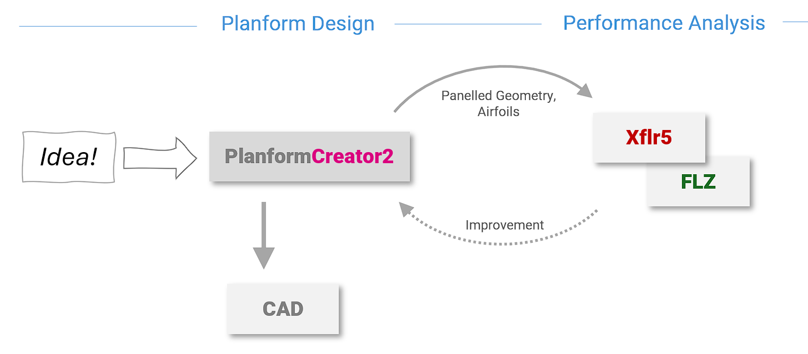
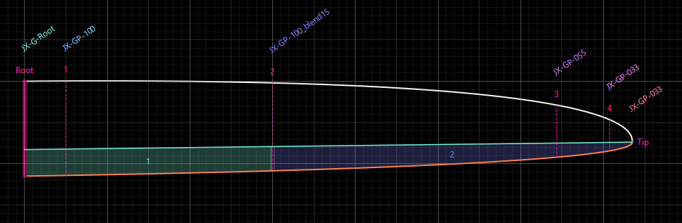

# v4.0.2

**PlanformCreator2** - short PC2 - is an app to design the planform of a wing focusing on model sailplanes. 

#### Planform Design 

* Define a planform based on a chord distribution and a reference line along wing span
* Import image of an existing wing as a background image for design
* Add wing sections with fixed position or relative chord length
* Define flaps hinge line and flaps 
* Export planform as dxf file for use in CAD

#### Airfoils and Polars
* Define airfoil at wing sections and edit its properties using the [Airfoil Editor](https://github.com/jxjo/AirfoilEditor)
* Generate blended airfoils for intermediate wing sections ('strak')
* View polars of the airfoil based on xfoil polar generation

#### Wing Analysis
* Auto paneling of the planform as preparation for aerodynamic calculation 
* VLM based lift calculation 
* Determine critical sections where cl_max of airfoils will be reached
* Export wing definition to Xflr5 and FLZ_vortex for further analysis

The project was inspired by the 'Planform Creator' being part of [The Strak Machine](https://github.com/Matthias231/The-Strak-Machine).

## Basic Concepts

The idea behind **PlanformCreator2** is to have a tool to design a new wing with a more graphical, playful approach. It tries to fill the gap between CAD based design and aerodynamic analysis tools like Xflr5.



During the early design phase, **PlanformCreator2** serves as the single source of truth for wing geometry. It provides data for aerodynamic analysis and includes built-in lift and stall analysis capabilities. 
More detailed performance assessments can be performed using external tools. 

Once the design is finalized, the planform and airfoils are exported as DXF files to a CAD program for final 3D design work, such as creating molds. 

Unlike a "paint program," the planform is defined parametrically using values such as 'span', 'root depth', and 'sweep angle'. The chord distribution along the span is controlled by mathematical functions with adjustable parameters.
This parametric approach allows independent parameter adjustments, enabling rapid iteration toward the desired wing planform.


## Designing a Planform 

'Form follows Function' - this is especially true in PC2, where the planform results from a combination of mathematical functions and parameters. 

### Chord Distribution and Chord Reference
The most important element, typically defined first, is the chord distribution along the wing span. The geometric chord distribution directly determines the lift distribution, as the local lift coefficient depends on both the effective angle of attack (influenced by wing shape) and the local Reynolds number (which varies proportionally with chord length).

Two methods are available for defining the chord distribution:
- **Bezier curve**: The curve is defined by dragging control points with the mouse, using a start tangent at the root and an end tangent at the tip.<br>
Additional Bezier control points can be added to achieve a wide range of chord distributions.<br>
A constant chord area can be created by moving the Bezier start point toward the tip.
- **Trapezoid**: For single or multiple trapezoid wings, the chord is defined by the chord length at each wing section.

In PC2, the chord distribution is always displayed in normalized form, with both span and chord length ranging from 0 to 1. This enables direct comparison of chord distributions across different wing designs without distortion.

The second key element is the 'Chord Reference', which defines how the chord is distributed between the leading and trailing edges along a virtual 'Chord Reference Line'.  


The final planform is created by combining these two functions, scaling the result to a half-wing span, and optionally applying a 'Sweep Angle' transformation.


#### Variations of the Chord Reference 

The Chord Reference concept enables powerful planform variations. Since the chord distribution remains constant, all variations maintain the same wing area and nearly identical aerodynamic properties as a first approximation. 

The following diagram demonstrates how different chord references affect the planform while maintaining a constant chord distribution.
 


#### The Banana Function

A unique feature is the "banana function," which bends the wing spanwise like a banana without altering the chord distribution or reference. This creates planforms similar to popular 'bow-style' flying wings. 

Another application is fine-tuning flap depth along the span. Since the flap hinge line (described below) is straight, bending the planform directly affects flap depth. 


### Background Image

To create a wing based on an existing image, you can load it as a background in the app. With a planform contour visible in the background, defining the chord distribution and chord reference for optimal fit is typically straightforward.

A built-in image editor allows you to scale the image and adjust colors to create a dark mode version best suited for use as a background. 

Image scaling is performed by positioning two scale markers at the leading edge of the root and at the wing tip.  


### Wing Sections

Once the planform is defined, wing sections become the next key element. A wing section serves two main purposes:
* Define the position of an airfoil within the planform
* Define the flap hinge line position and the start of a 'flap group'

Every wing has at least two wing sections: root and tip. Additional sections can be added between them. Wing section locations can be defined in two ways:
- **By span position**: The wing section remains at a fixed relative span position, regardless of changes to wing span or chord distribution. This mode is useful for defining flaps.
- **By chord length**: The wing section maintains a constant relative chord length. When the chord distribution changes, the section repositions itself to preserve this chord length. This is particularly useful for maintaining an airfoil at a specific chord length (and thus Reynolds number).


<sup>In this example, wing section '1' at a fixed position is used to define the width of flap and aileron, while section '2' is the home of airfoil 'JX-GP-055' ensuring a certain chord. </sup>

A special case arises with trapezoidal planforms. Here wing sections are also used to define the chord distribution by having both: a fixed chord and a fixed span position. 


<sup>In this trapezoidal planform, wing sections 'root', '1' and 'tip' define the planform. Wing section '2' is just a helper section to have an additional flap at this position. </sup>


### Hinge Line and Flap Depth

Flaps are defined by their hinge line and the wing sections that bound them on either side. A wing section can be assigned a 'flap group', and all subsequent wing sections with the same flap group form a single flap.

Typically, the hinge line coincides with the planform's reference line, which is also the default when defining flaps. 

Greater flexibility can be achieved by defining a separate hinge line with hinge points at the root and tip sections. 
In some cases, such as when using a curved reference line, kinks in the hinge line can be defined at specific wing sections.


### Export as DXF File 
Once the wing design is complete, it can be exported to a CAD program as a DXF file. Airfoils can optionally be inserted into the drawing and/or exported separately as .dat files.

A useful feature allows you to define a common trailing edge thickness (trailing edge gap) in millimeters for all airfoils.
This eliminates the need for manual post-processing of airfoils in CAD. 


**Note:** The generated planform contour is approximated by many small straight line segments (polyline) and should not be used directly for 3D construction. It is recommended to overlay splines on the leading and trailing edges in your CAD program for smooth surfaces.

### Export as CSV File

The geometric data of the wing sections, including spanwise position and leading/trailing edge coordinates, can be exported to a CSV file for further processing in apps such as Excel.


## Airfoils and Polars

### Assignment of Airfoils

A wing section can be assigned either a fixed airfoil or left unassigned. When unassigned, a 'strak' (blended) airfoil is automatically created by blending the neighboring airfoils from adjacent sections. The blending ratio is determined by the relative chord lengths of the wing sections.

Root and tip sections require mandatory airfoil assignments. By default, example airfoils are initially assigned to these sections.



<sup>Wing sections with the corresponding airfoils. The airfoil at 'section 2' is created by blending JX-GP-100 and JX-GP-055.</sup>


Airfoils can be viewed in normalized scale or in their actual scale within the wing sections.

**PlanformCreator2** includes the [AirfoilEditor](https://github.com/jxjo/AirfoilEditor), which provides common airfoil modification capabilities during wing design. 

During the final design stage, all airfoil — including generated 'straked' airfoils — can be exported as .dat files. An optional feature allows setting a uniform trailing edge thickness ('TE gap') in millimeters for all airfoils, eliminating the manual rework typically required in CAD.


### Airfoil Polars

**PlanformCreator2** uses the Worker tool from the [Xoptfoil2 project](https://jxjo.github.io/Xoptfoil2) to generate airfoil polars. One Worker capability is the multi-threaded creation of polar sets using Xfoil.

Polars are generated on-demand (lazily) when needed for display, running asynchronously in background tasks. Each polar is stored as a separate file in Xfoil format, enabling direct import into Xflr5. 

The Worker's `auto_range` feature optimizes the alpha range to display the complete T1 polar from `cl_min` to `cl_max` for each airfoil. 

A specific Reynolds number is defined for the root wing section. For other sections, the Reynolds number is automatically adjusted based on local chord length. All wing section polars are then generated as a unified set.


<sub>Airfoil and polar view showing auto-generated, Reynolds number-adjusted polars for airfoils at defined wing sections.</sub>

The spanwise polar distribution provides an initial assessment of the airfoil strak, particularly toward the tip where Reynolds numbers are lower.

## Wing Analysis

### Panel Generation

Aerodynamic analysis of a wing requires discretization into panels. PC2 provides several features to support this paneling process. 

The paneled planform can be exported to Xflr5 and FLZ_vortex, or used for the integrated aerodynamic analysis described below.

The initial paneling step involves defining the number of x and y-panels for each section. With curved leading or trailing edges, this can produce significant geometric deviations between the original contour and the idealized panels, resulting in substantial inaccuracies in aerodynamic calculations.


<sup>Initial panelling of a planform having a single wing section '1' between root and tip. The deviation between the original contour and the trapezoidal contour, marked with yellow lines, is way to high to achieve valid results in aerodynamic calculation. </sup>


Mesh optimization can then be applied using the following parameters:

* Minimum panel width – The number of y-panels per section is adjusted to achieve uniform panel width along the span
* Minimum chord deviation to planform** – Additional wing sections are inserted automatically until the deviation of the section trapezoids from the original planform falls below the defined threshold
* Minimum chord at tip – The tip is trimmed to achieve a Reynolds number that produces meaningful Xfoil results


<sup>Auto-optimized paneling reduces deviation between original and idealized contour. The maximum chord deviation is now below 2%, sufficient to achieve reasonable results.</sup>

Like airfoil polar generation, panel generation occurs on-demand: a new mesh is initialized whenever the planform is modified.


#### Export to Xflr5

When using PC2 together with Xflr5 the major facilitation beside the definition of wing segments, is the automatic generation of all intermediate airfoils needed in Xflr5 at all wing sections. No further geometric work has to be done for wing definition and airfoils. 

Please read [the short description](doc/PC2_export_to_Xflr5.md) of how it works.


#### Export to FLZ_vortex


PC2 generates a ready to use FLZ_vortex project file which can be loaded as a new 'flight scene' ('Flugszene') or FLZ_vortex can be launched directly from PC2 having the project file loaded. For direct launch the file extension .flz must be assigned to the app FLZ_vortex. 

Do not forget to adjust the plane mass in FLZ before running a calculation.

### VLM Analysis

PC2 includes an integrated VLM (Vortex Lattice Method) module to calculate the lift distribution along the span based on the previously generated paneling.


The primary objective of aerodynamic analysis in PC2 is to identify wing regions that will stall first when the angle of attack increases. For this assessment, 2D airfoil polar data and 3D lift aerodynamic data are combined in a viscous loop.

To obtain 2D airfoil data, additional polars with forced transition close to the leading edge are evaluated. These additional polars enable more accurate determination of alpha0, as they do not exhibit Xfoil artifacts around alpha0 in the cl(alpha) polar.

Airfoil polars are evaluated for each wing section. Wing analysis supports only T1 polars (constant speed).

The viscous loop of the VLM analysis calculates the effective Cl and alpha for each panel station along the span.


The maximum possible angle of attack (close to stall) is automatically evaluated and the critical area is marked within the paneling view and in the lift distribution view:


<sup>Simple wing example showing the critical wing regions where local Cl reaches cl max of the airfoil.</sup>

By activating the chord distribution view, the chord and thus the area in which the wing will stall first can be changed interactively.


<sup>Interactive change in the chord distribution and thus the area in which the wing tends to stall first</sup>


## The App - a quick look 
  
**PlanformCreator2** provides a simple, intuitive UI for exploring the application and designing new wings. 


- The upper tabs switch between different main views
- The panel on the left allows customization of settings for the current diagram
- The bottom left contains standard file and action functions 

- The lower main panel provides input and modification of planform parameters. Key parameters can also be adjusted directly in the diagram using interactive control points

For new users, the 'Welcome' panel provides additional explanations and allows immediate modification of the sample planform. The 'New' function offers predefined templates that serve as good starting points for your project.


## Software Aspects

`PlanformCreator2` is developed in [Python](https://www.python.org/) using [PyQt6](https://pypi.org/project/PyQt6/), which wraps and extends the Qt UI framework, and [PyQtGraph](https://www.pyqtgraph.org/), which wraps the Qt Graphics framework. 

The main building blocks are:

* Model — Contains all geometry and mathematical helper routines to create and modify wing planforms. The model is independent of the UI.

* VLM — For lift distribution calculations, the Python VLM implementation [Panel Aero](https://github.com/DLR-AE/PanelAero) is used as the core module (thanks to Arne Voß, DLR).

* UI Framework — Base classes and a framework to ease implementation of forms based on widgets and diagrams. Plots in diagrams are handled by artists, each visualizing specific data aspects of a planform. The base classes are imported from the [Airfoil Editor](https://github.com/jxjo/AirfoilEditor) project as a package.

* Application — App modes and view panels handle presentation and user interaction. 


# Installation

### Windows Easy Setup

A Windows Installer including Worker for polar generation is available in the [releases section on GitHub](https://github.com/jxjo/PlanformCreator2/releases).

Download and run the setup program. During installation, you may define whether the file extension .pc2 (PlanformCreator2 project files) shall be assigned to the app. 

When running the downloaded setup file, Windows SmartScreen may display a warning: "Windows protected your PC" with "Unknown publisher". **This is normal** for open-source software distributed without a code signing certificate.

To install in this case:
1. Click "More info"
2. Click "Run anyway"


### Windows Setup using Python

If you already have installed Python version >=3.12, it is advantageous to install the PlanformCreator2 as a 'package'. 
This will startup the app faster than using the standalone .exe file. 
The package already includes Worker and Xoptfoil2. 

Install the app:
```
pip install planformcreator2 
```

To upgrade to the actual version use `pip install planformcreator2 -U`.

Run the app by typing `planformcreator2` on the command line.

The command `where planformcreator2.exe` will show, where Python installed the program within your filesystem.
This file path can be used to create a shortcut on your desktop or to assign the file extension '.dat' to the app,  allowing to open an airfoil with a double click. 

If you just want to try out the app and want to ensure, that the installation doesn't influence other packages, you may prefer to install the package in an 'virtual environment'. For daily use a 'normal' installation is more convenient.


### Linux and MacOS

The app is installed as a Python 'package'. Please ensure to have a Python version >=3.12.

`pip3 install planformcreator2`

To upgrade to the actual version use

 `pip3 install planformcreator2 -U`

Run the app by typing `planformcreator2` on the command line.

The command `which planformcreator2` will show, where Python installed the program within your filesystem.
This file path can be used to create a shortcut on your desktop or to assign the file extension '.dat' to the app,  allowing to open an airfoil with a double click. 


#### Preparing Worker
To use polar generation and wing analysis the program `worker` has to be compiled and made available for PlanformCreator2 by copying the program into /usr/local/bin. 

Please have a look into [Xoptfoil2 README](https://github.com/jxjo/Xoptfoil2#Installation) for further information.

As a little reward for the extra effort polar generation will run 2-3 times faster on Linux compared to the Windows version.

#### Ubuntu

If there is warning message like "Failed to create wl_display" when starting the app, set a QT environment variable with `export QT_QPA_PLATFORM=xcb`.

### Cloning from Github

If you want to clone the PlanformCreator2 repo from GitHub for local development, the following package have to be installed in your (virtual) python environment 

```
pip install airfoileditor
pip install ezdxf
```

### Changelog

See [CHANGELOG.md](CHANGELOG.md) for history of changes.


# Finally 

I hope you enjoy working with the **PlanformCreator2**.

jochen@jxjo.de
